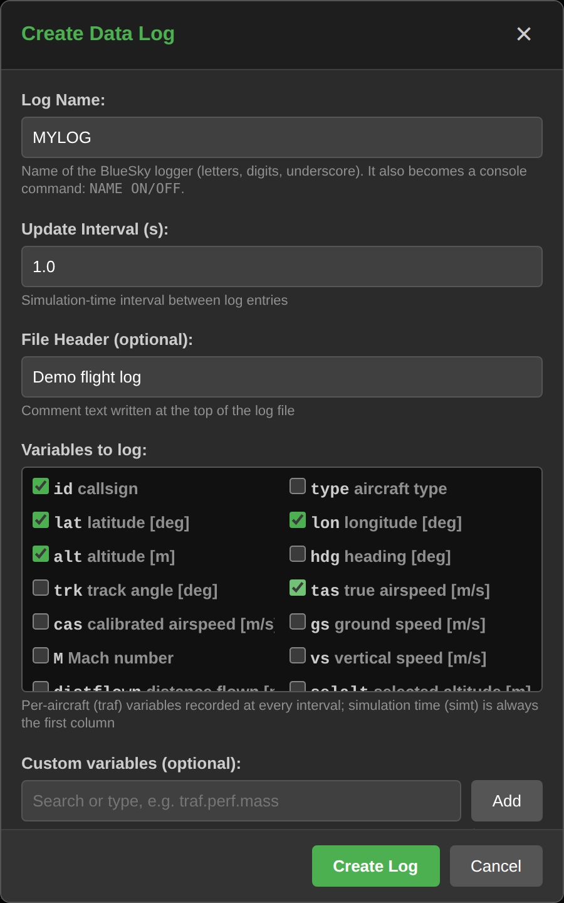
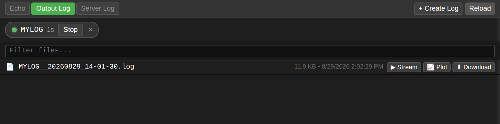
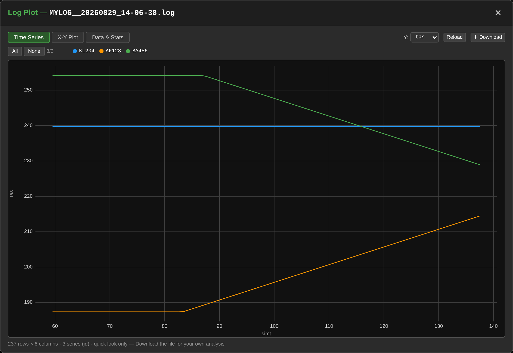
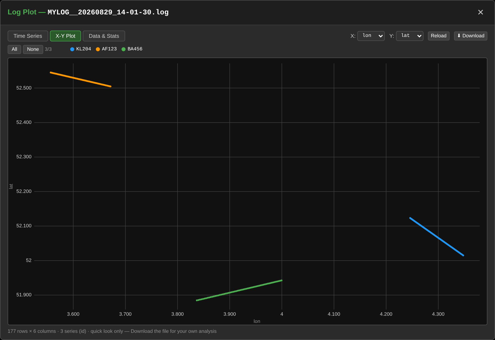

# Logging & Plotting

WebATM can record simulation data with BlueSky data logs (`CRELOG`) and give
you a quick look at the results — all from the browser, no spreadsheet needed.

!!! note "Prerequisites"
    You must be **connected to a BlueSky server**, and the **BlueSky base
    directory** must be configured (Settings → BlueSky base path) so WebATM can
    list the `output/` folder. The [Integrated Build](integrated-build.md) does
    both automatically.

## Create a data log

Open the **Output Log** tab in the bottom-right console pane and click
**+ Create Log**:

{ width=520 }

- **Log Name** — name of the BlueSky logger; it also becomes a console command
  (`MYLOG ON` / `MYLOG OFF`).
- **Update Interval** — simulation-time seconds between log entries.
- **Variables to log** — tick the per-aircraft (`traf.*`) variables to record;
  simulation time (`simt`) is always the first column. Other variables (e.g.
  `traf.perf.mass`) can be added under **Custom variables**, with live search
  and validation against the running simulation.

The dialog shows a live preview of the BlueSky commands it will send — the
equivalent of typing this in the command console:

```text
CRELOG MYLOG,1,Demo flight log
MYLOG ADD traf.id,traf.lat,traf.lon,traf.alt,traf.tas
MYLOG ON
```

With **Start logging immediately** ticked, the log starts as soon as you click
**Create Log**, and a quick-control chip appears above the file list to stop or
restart it at any time.

## Browse log files

The Output Log tab lists everything in BlueSky's `output/` directory. Each log
gets a timestamped file you can **Stream** (follow live), **Plot**, or
**Download**:



## Plot a log

Click **📈 Plot** on any `.log` or `.csv` file. The plot modal parses the file
and groups rows per aircraft — click a legend chip to toggle a series
(shift-click to solo it), and use **Reload** to re-fetch a log that is still
growing.

**Time Series** plots any numeric column against simulation time — here the
true airspeed of three aircraft, one accelerating and one decelerating:



**X-Y Plot** plots any two columns against each other; with `lat`/`lon` logged
it defaults to a ground track:



**Data & Stats** shows per-column statistics and the last rows of the file.
The plots are a quick look, not an analysis tool — use **Download** to take the
raw file into another tool.

!!! note "Not every log is plottable"
    The plot views expect periodic data logs like the ones created above —
    numeric columns sampled at a fixed interval. BlueSky can also write other
    kinds of logs, e.g. event-based logs created with stack commands or by
    plugins (conflict logs, flight-statistics logs, …). Those still appear in
    the file list and can be downloaded, but the modal will tell you they
    can't be plotted — download them and analyze them with your own tools.
