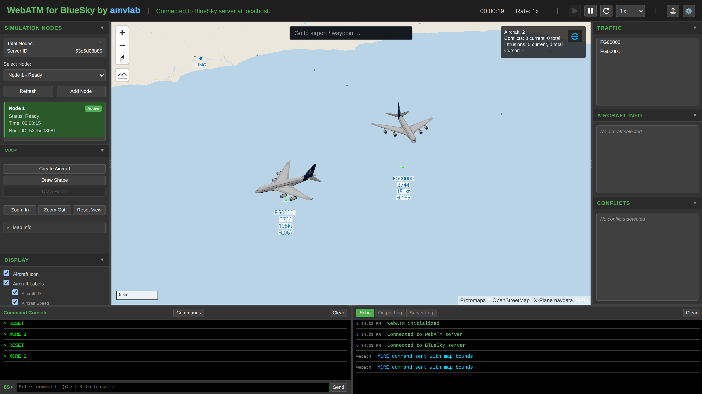

# Offline Use with PMTiles

WebATM supports fully offline operation using
[PMTiles](https://protomaps.com/docs/pmtiles) — a single-file,
cloud-optimized map archive format. Once set up, WebATM makes no CDN calls
during page load and no remote tile requests, so it works in air-gapped
environments, aircraft, ships, field deployments, and other networks without
reliable internet.



## Why PMTiles?

- **Single file deployment** — one `.pmtiles` archive replaces an entire tile
  server. No tile cache, no tile seeding scripts, no background jobs.
- **No server software required** — PMTiles is read client-side via HTTP
  `Range` requests, which Flask's default static handler already supports.
- **Portable** — drop the file onto a USB stick, ship it with a Docker image,
  or host it on any static file server.

## Setup

1. **Build with internet available.** `script/build_frontend.sh` (or
   `npm run build` in `frontend/`) triggers a prebuild step that copies
   MapLibre GL CSS, the MapLibre GL map worker, and Font Awesome assets from
   `node_modules` into `WebATM/static/vendor/`, and webpack bundles MapLibre
   GL JS and `socket.io-client` into the app bundles. After this step the
   page loads every library locally.

2. **Drop in an offline basemap.** Download a PMTiles archive (e.g. the
   [Protomaps worldwide basemap](https://maps.protomaps.com/builds/)) and
   save it to:

    ```
    WebATM/static/tiles/world.pmtiles
    ```

    The offline style at `WebATM/static/map/offline-style.json` expects that
    exact path.

    !!! warning "Reverse proxies"
        Make sure `.pmtiles` files are **not** gzip-encoded — PMTiles relies
        on HTTP `Range` requests, which Flask's default static handler
        supports out of the box.

3. **Select the offline map.** Open Settings → Map Display Configuration and
   choose **Offline (Local PMTiles)**. The app also auto-falls-back to the
   offline style if it detects that the configured online style can't be
   reached (e.g. no DNS, captive portal, blocked outbound) — including when
   the request hangs without ever failing: a reachability probe with a short
   timeout swaps to the offline basemap within a few seconds of first load.

The offline styles (`offline-style.json` and its light variant
`offline-style-light.json` in `WebATM/static/map/`) are minimal
Protomaps-schema basemaps with no text labels of their own, so no sprite
sheets need to be bundled. WebATM's **overlay** labels (airport and waypoint
names, shape labels, aircraft tags) do need map glyphs to render offline:
they use the `Open Sans Regular` fontstack served from
`WebATM/static/glyphs/`. The prebuilt release assets bundle already includes
it; if you build from source, see `WebATM/static/glyphs/README.md` for how to
populate it.

## Generating a custom regional archive

The worldwide Protomaps build is ~110 GB. For a specific region (e.g. a
single FIR or training area), the
[`pmtiles` CLI](https://github.com/protomaps/go-pmtiles) can extract a
bounding-box subset from the global archive, bringing the file size down to a
few MB–GB depending on coverage and max zoom:

```bash
pmtiles extract https://build.protomaps.com/<build>.pmtiles region.pmtiles \
  --bbox=<minLon>,<minLat>,<maxLon>,<maxLat> \
  --maxzoom=12
```

Copy the resulting `region.pmtiles` to `WebATM/static/tiles/world.pmtiles`
(the filename the offline style expects) and you're done.

## Navdata overlay (airports, runways, navaids)

The airport overlay (airport symbols, runway polygons, radio navaids, and the
map's "go to" search box) does **not** come from the basemap — it is a
separate archive that works at full detail regardless of the basemap's zoom
range. It is built from the public-domain
[OurAirports](https://ourairports.com/data/) open data
(`airports.csv`, `runways.csv`, `navaids.csv`, downloaded automatically) by
the offline build pipeline in `scripts/navdata/`:

```bash
cd scripts/navdata
./build_navdata_tiles.sh
```

This needs [tippecanoe](https://github.com/felt/tippecanoe) (for `tippecanoe`
and `tile-join`) plus `python3` and `curl`, and produces two outputs:

- `WebATM/static/tiles/navdata.pmtiles` — the vector-tile archive rendered
  by the map (airports, heliports, runways, waypoints).
- `WebATM/static/navdata/navdata.sqlite` — the search index behind
  `GET /api/navdata/search`, used by the map's "go to" box.

!!! note
    Both outputs are gitignored (large/binary) and are already included in
    the prebuilt release assets bundle — you only need to run the pipeline
    when building your own data. See
    [scripts/navdata/README.md](https://github.com/amvlab/WebATM_core/blob/main/scripts/navdata/README.md)
    for what each dataset provides and the zoom/declutter tuning flags.

### Taxiways & aprons (OpenStreetMap)

Taxiways and aprons are the exception, since OurAirports has no geometry for
them — they come from OpenStreetMap:

- **Taxiway centrelines** are included in Protomaps planet builds (in the
  `roads` layer) from roughly z11 upward. A common worldwide extract at
  `--maxzoom=8` therefore contains none of them; a regional extract with
  `--maxzoom=13` or higher does, and WebATM renders them automatically under
  the **Taxiways & Aprons** display toggle.
- **Apron polygons are not present in Protomaps builds at all** (the schema
  has no apron kind). To get true aprons — and taxiways independent of the
  basemap's zoom range — bake them into the navdata archive from an OSM
  extract instead:

  ```bash
  cd scripts/navdata
  ./build_navdata_tiles.sh --osm-pbf /path/to/region-latest.osm.pbf
  ```

  This additionally needs [osmium](https://osmcode.org/osmium-tool/) on the
  PATH; the navdata README covers a worldwide-coverage recipe built from
  continent extracts. When the navdata archive contains these layers they
  take precedence over the basemap's `aeroway` data, so nothing is ever
  drawn twice.
